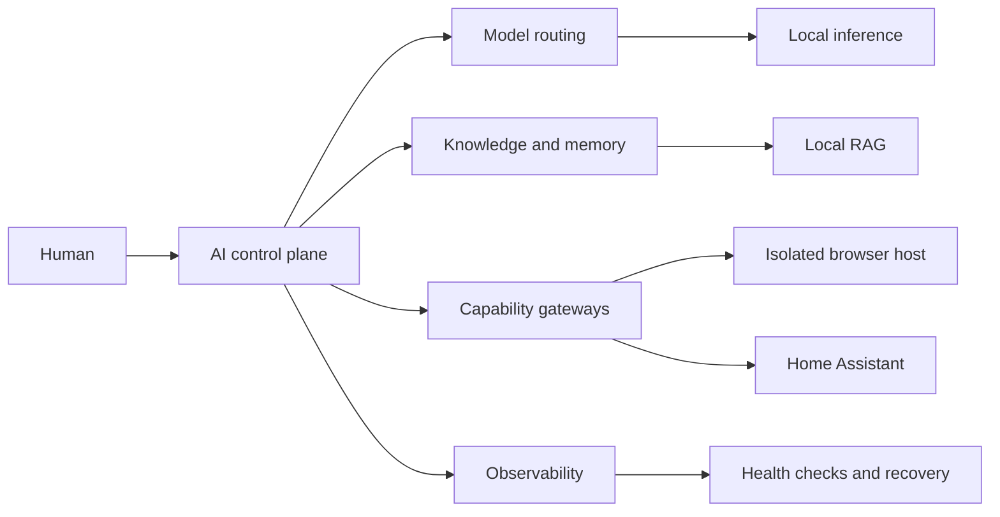

# Private AI Control Plane

Building a practical, privacy-first AI platform at home.

This project documents a working home AI platform that connects local inference,
durable knowledge, browser automation, smart-home services, and operational
monitoring. The goal is not to collect tools. It is to make them behave like one
reliable system.

> **Project status:** active build. This repository begins as a sanitized
> engineering journal and reference architecture. Reusable deployment artifacts
> will be added as they are tested and stripped of environment-specific details.

## What makes this different

Most home AI projects stop after a model answers a prompt. This one focuses on
the harder operational questions:

- How does an agent choose between local models and other services?
- How can it retrieve useful context without exposing private data?
- How do browser and home-automation capabilities cross machine boundaries safely?
- What happens when a gateway, model endpoint, or Windows node fails?
- How can the platform be observed, repaired, and upgraded without becoming fragile?

## Platform at a glance



The platform currently brings together:

- **Orchestration:** OpenClaw and Hermes
- **Compute:** Proxmox-hosted services and local GPU inference
- **Knowledge:** local retrieval, Qdrant-backed collections, and curated memory
- **Actions:** a dedicated Windows browser node and Home Assistant integrations
- **Operations:** health checks, recovery procedures, and upgrade verification

Specific addresses, credentials, device names, and personal data are deliberately
excluded from this public-facing design.

## Current capabilities

| Capability | Status | Proof planned for this repo |
| --- | --- | --- |
| Local model routing | Working | Redacted request and routing trace |
| Local RAG and memory | Working | Retrieval quality walkthrough |
| Cross-machine browser automation | Working | Windows localhost demo |
| Home Assistant integration | Working | Safe, non-sensitive automation demo |
| Service recovery playbooks | Working | Failure and recovery case studies |
| Unified observability | In progress | Dashboard and alerting walkthrough |

## Demonstrations

The first three public demonstrations are designed to show outcomes rather than
hardware:

1. **Remote browser, local page:** an AI gateway controls an isolated Edge profile
   on Windows and reads a development site bound to Windows localhost.
2. **Useful private recall:** a question is answered from locally indexed project
   material with source-backed retrieval.
3. **Safe household action:** the control plane inspects state and performs one
   explicitly authorized Home Assistant action.

See [docs/demos.md](docs/demos.md) for the evidence checklist.

## Engineering principles

- Local-first where it provides a real privacy, latency, or resilience benefit.
- Explicit authorization for external or destructive actions.
- Separate identities and narrow capabilities for different node roles.
- Reproducible tests before declaring an integration operational.
- Public documentation contains no secrets, personal data, or network details.
- Failures and tradeoffs are documented, not edited out of the story.

## Repository map

```text
.
├── docs/
│   ├── architecture.md
│   ├── demos.md
│   ├── roadmap.md
│   └── security.md
├── examples/          # Sanitized examples as they become reusable
├── scripts/           # Tested diagnostics and setup helpers
└── README.md
```

## Follow the build

This repository is the technical companion to a personal **AI major domo** build
journey. Updates will be small and concrete: one capability, measurement, failure,
or lesson at a time.

If you are building something similar, open a discussion with your architecture,
constraints, or the failure mode giving you trouble.

## License

No license has been selected yet. Until one is added, the contents remain
copyrighted and are shared for evaluation and discussion only.
