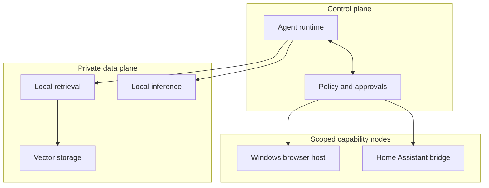

# Architecture

## Design goal

The platform should provide one understandable control surface over several
independent systems while keeping trust boundaries visible. An orchestration layer
may coordinate capabilities, but it should not silently inherit unrestricted
access to every machine or service.

## Logical layers

### 1. Interaction and orchestration

The orchestration layer receives requests, selects tools, maintains task context,
and enforces approval boundaries. OpenClaw is the primary control plane. Hermes is
used where its gateway and model integrations fit the workload.

### 2. Model serving

Local inference endpoints serve workloads that benefit from privacy, predictable
cost, or hardware locality. Model selection is workload-driven rather than based
on a single default model.

Current experimental compute includes:

- GPU-backed endpoints for code and general assistant workloads
- A separate lane for 3D-generation experiments
- A smaller utility accelerator lane for runtime and compatibility testing

Hardware details and benchmarks will be published only when the tests are
repeatable.

### 3. Knowledge and memory

The knowledge layer separates curated durable memory from broader searchable
project material. Local retrieval provides source-backed context without placing
the whole document collection into every prompt.

### 4. Capability nodes

Capabilities that must run on another operating system are exposed through
dedicated nodes. Browser automation uses a separate Windows identity and isolated
browser profile. This prevents the desktop companion from becoming an accidental
catch-all execution path.

### 5. Home services

Home Assistant exposes narrowly scoped device and state operations. Sensitive
domains such as access control require stricter boundaries and are not treated as
ordinary automation targets.

### 6. Operations

Health checks validate the actual end-to-end behavior of a capability, not merely
whether a process exists. Upgrade procedures include checks for local patches,
configuration compatibility, routing, and service persistence.

## Trust boundaries

Each arrow represents an intentionally configured route. It is not evidence that
the control plane should have unrestricted administrative access to the target.

## Evidence standard

A component is described as **working** only after an end-to-end test proves the
user-visible outcome. Process status, successful installation, or a connected
socket are useful diagnostics, but they are not sufficient proof by themselves.

